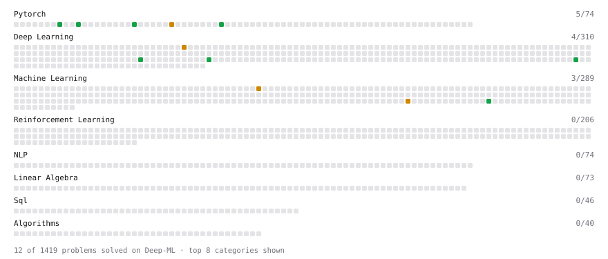

# Deep-ML

My machine learning practice from [Deep-ML](https://www.deep-ml.com). Every solution here was written by hand.

**14** solved · 14 problems · 0 labs · 0 math

[**Browse the interactive portfolio**](https://udit4code.github.io/deep-ml/) to replay this filling in over time.

## Problems

| | Difficulty | Solved | |
| --- | --- | --- | --- |
| [Balance Dataset via Undersampling](https://www.deep-ml.com/problems/1057) | easy | 2026-09-17 | [solution](problems/1057-balance-dataset-via-undersampling) |
| [Build a Dataset and Use It with a DataLoader](https://www.deep-ml.com/problems/899) | easy | 2026-09-17 | [solution](problems/0899-build-a-dataset-and-use-it-with-a-dataloader) |
| [Build an MLP with nn.Sequential](https://www.deep-ml.com/problems/887) | easy | 2026-09-17 | [solution](problems/0887-build-an-mlp-with-nn-sequential) |
| [Generate Input-Target Batches for Language Model Training](https://www.deep-ml.com/problems/1080) | easy | 2026-09-17 | [solution](problems/1080-generate-input-target-batches-for-language-model-training) |
| [Implement LayerNorm from Scratch](https://www.deep-ml.com/problems/908) | easy | 2026-09-17 | [solution](problems/0908-implement-layernorm-from-scratch) |
| [Reshape and Transpose a Tensor](https://www.deep-ml.com/problems/1221) | easy | 2026-09-17 | [solution](problems/1221-reshape-and-transpose-a-tensor) |
| [Scale Attention Scores by sqrt(d_k)](https://www.deep-ml.com/problems/963) | easy | 2026-09-17 | [solution](problems/0963-scale-attention-scores-by-sqrt-d-k) |
| [Token Embedding Lookup Table](https://www.deep-ml.com/problems/945) | easy | 2026-09-17 | [solution](problems/0945-token-embedding-lookup-table) |
| [GPT FeedForward Block (Linear-GELU-Linear)](https://www.deep-ml.com/problems/1007) | medium | 2026-09-17 | [solution](problems/1007-gpt-feedforward-block-linear-gelu-linear) |
| [Implement Efficient Sparse Window Attention](https://www.deep-ml.com/problems/131) | medium | 2026-09-17 | [solution](problems/0131-implement-efficient-sparse-window-attention) |
| [Implement Masked Self-Attention](https://www.deep-ml.com/problems/107) | medium | 2026-09-17 | [solution](problems/0107-implement-masked-self-attention) |
| [Implement Multiquery Attention (MQA)](https://www.deep-ml.com/problems/390) | medium | 2026-09-17 | [solution](problems/0390-implement-multiquery-attention-mqa) |
| [Numerically Stable Cross-Entropy](https://www.deep-ml.com/problems/914) | medium | 2026-09-17 | [solution](problems/0914-numerically-stable-cross-entropy) |
| [Sliding Window Attention](https://www.deep-ml.com/problems/388) | medium | 2026-09-17 | [solution](problems/0388-sliding-window-attention) |

---

_This file is regenerated by Deep-ML on every push._
