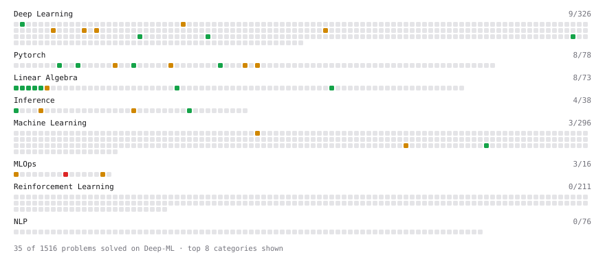

# Deep-ML

My machine learning practice from [Deep-ML](https://www.deep-ml.com). Every solution here was written by hand.

**62** solved · 61 problems · 1 labs · 0 math

[**Browse the interactive portfolio**](https://udit4code.github.io/deep-ml/) to replay this filling in over time.

## Problems

| | Difficulty | Solved | |
| --- | --- | --- | --- |
| [Balance Dataset via Undersampling](https://www.deep-ml.com/problems/1057) | easy | 2026-09-17 | [solution](problems/1057-balance-dataset-via-undersampling) |
| [Batch Iterator for Dataset](https://www.deep-ml.com/problems/30) | easy | 2026-01-17 | [solution](problems/0030-batch-iterator-for-dataset) |
| [Build a Dataset and Use It with a DataLoader](https://www.deep-ml.com/problems/899) | easy | 2026-09-17 | [solution](problems/0899-build-a-dataset-and-use-it-with-a-dataloader) |
| [Build an MLP with nn.Sequential](https://www.deep-ml.com/problems/887) | easy | 2026-09-17 | [solution](problems/0887-build-an-mlp-with-nn-sequential) |
| [Calculate Cosine Similarity Between Vectors](https://www.deep-ml.com/problems/76) | easy | 2025-08-01 | [solution](problems/0076-calculate-cosine-similarity-between-vectors) |
| [Calculate Covariance Matrix](https://www.deep-ml.com/problems/10) | easy | 2026-01-17 | [solution](problems/0010-calculate-covariance-matrix) |
| [Calculate Mean by Row or Column](https://www.deep-ml.com/problems/4) | easy | 2025-08-01 | [solution](problems/0004-calculate-mean-by-row-or-column) |
| [Compute Arithmetic Intensity and Classify Bottleneck](https://www.deep-ml.com/problems/414) | easy | 2026-10-05 | [solution](problems/0414-compute-arithmetic-intensity-and-classify-bottleneck) |
| [Convert Vector to Diagonal Matrix](https://www.deep-ml.com/problems/35) | easy | 2026-01-17 | [solution](problems/0035-convert-vector-to-diagonal-matrix) |
| [Create a Float Tensor from a Python List](https://www.deep-ml.com/problems/880) | easy | 2026-06-22 | [solution](problems/0880-create-a-float-tensor-from-a-python-list) |
| [Derivative of a Polynomial](https://www.deep-ml.com/problems/116) | easy | 2026-06-10 | [solution](problems/0116-derivative-of-a-polynomial) |
| [Feature Scaling Implementation](https://www.deep-ml.com/problems/16) | easy | 2026-01-22 | [solution](problems/0016-feature-scaling-implementation) |
| [Generate Input-Target Batches for Language Model Training](https://www.deep-ml.com/problems/1080) | easy | 2026-09-17 | [solution](problems/1080-generate-input-target-batches-for-language-model-training) |
| [Implement LayerNorm from Scratch](https://www.deep-ml.com/problems/908) | easy | 2026-09-17 | [solution](problems/0908-implement-layernorm-from-scratch) |
| [Implement ReLU Activation Function](https://www.deep-ml.com/problems/42) | easy | 2026-01-26 | [solution](problems/0042-implement-relu-activation-function) |
| [Implement the Softsign Activation Function](https://www.deep-ml.com/problems/100) | easy | 2026-06-08 | [solution](problems/0100-implement-the-softsign-activation-function) |
| [Implement the Swish Activation Function](https://www.deep-ml.com/problems/102) | easy | 2026-06-08 | [solution](problems/0102-implement-the-swish-activation-function) |
| [Label Encoding for Ordinal Variables](https://www.deep-ml.com/problems/356) | easy | 2026-05-26 | [solution](problems/0356-label-encoding-for-ordinal-variables) |
| [Leaky ReLU Activation Function](https://www.deep-ml.com/problems/44) | easy | 2026-07-02 | [solution](problems/0044-leaky-relu-activation-function) |
| [Linear Kernel Function](https://www.deep-ml.com/problems/45) | easy | 2026-01-22 | [solution](problems/0045-linear-kernel-function) |
| [Linear Regression Using Normal Equation](https://www.deep-ml.com/problems/14) | easy | 2026-06-10 | [solution](problems/0014-linear-regression-using-normal-equation) |
| [Matrix-Vector Dot Product](https://www.deep-ml.com/problems/1) | easy | 2026-01-14 | [solution](problems/0001-matrix-vector-dot-product) |
| [Min-Max Scaling of Feature Values](https://www.deep-ml.com/problems/112) | easy | 2026-01-22 | [solution](problems/0112-min-max-scaling-of-feature-values) |
| [One-Hot Encoding of Nominal Values](https://www.deep-ml.com/problems/34) | easy | 2026-02-13 | [solution](problems/0034-one-hot-encoding-of-nominal-values) |
| [Random Rotation Matrix and a Rotation Layer](https://www.deep-ml.com/problems/1190) | easy | 2026-10-05 | [solution](problems/1190-random-rotation-matrix-and-a-rotation-layer) |
| [Reshape and Transpose a Tensor](https://www.deep-ml.com/problems/1221) | easy | 2026-09-17 | [solution](problems/1221-reshape-and-transpose-a-tensor) |
| [Reshape Matrix](https://www.deep-ml.com/problems/3) | easy | 2026-01-14 | [solution](problems/0003-reshape-matrix) |
| [Scalar Multiplication of a Matrix](https://www.deep-ml.com/problems/5) | easy | 2026-01-14 | [solution](problems/0005-scalar-multiplication-of-a-matrix) |
| [Scale Attention Scores by sqrt(d_k)](https://www.deep-ml.com/problems/963) | easy | 2026-09-17 | [solution](problems/0963-scale-attention-scores-by-sqrt-d-k) |
| [Softmax Activation Function Implementation ](https://www.deep-ml.com/problems/23) | easy | 2025-11-29 | [solution](problems/0023-softmax-activation-function-implementation) |
| [Token Embedding Lookup Table](https://www.deep-ml.com/problems/945) | easy | 2026-09-17 | [solution](problems/0945-token-embedding-lookup-table) |
| [Transpose of a Matrix](https://www.deep-ml.com/problems/2) | easy | 2026-01-14 | [solution](problems/0002-transpose-of-a-matrix) |
| [Word Error Rate by Edit Distance](https://www.deep-ml.com/problems/1440) | easy | 2026-10-05 | [solution](problems/1440-word-error-rate-by-edit-distance) |
| [BLEU Score for Text Generation](https://www.deep-ml.com/problems/321) | medium | 2026-05-09 | [solution](problems/0321-bleu-score-for-text-generation) |
| [Build a Simple ETL Pipeline (MLOps)](https://www.deep-ml.com/problems/187) | medium | 2026-01-16 | [solution](problems/0187-build-a-simple-etl-pipeline-mlops) |
| [Build Scaled Dot-Product Attention](https://www.deep-ml.com/problems/490) | medium | 2026-09-17 | [solution](problems/0490-build-scaled-dot-product-attention) |
| [Calculate Eigenvalues of a Matrix](https://www.deep-ml.com/problems/6) | medium | 2025-09-24 | [solution](problems/0006-calculate-eigenvalues-of-a-matrix) |
| [Continuous Batching vs Static Batching Throughput Comparison](https://www.deep-ml.com/problems/452) | medium | 2026-09-17 | [solution](problems/0452-continuous-batching-vs-static-batching-throughput-comparison) |
| [Derivative of Softmax](https://www.deep-ml.com/problems/219) | medium | 2026-01-26 | [solution](problems/0219-derivative-of-softmax) |
| [Estimate KV Cache Size from Model Config](https://www.deep-ml.com/problems/418) | medium | 2026-10-05 | [solution](problems/0418-estimate-kv-cache-size-from-model-config) |
| [GPT FeedForward Block (Linear-GELU-Linear)](https://www.deep-ml.com/problems/1007) | medium | 2026-09-17 | [solution](problems/1007-gpt-feedforward-block-linear-gelu-linear) |
| [Handle Missing Data with Imputation](https://www.deep-ml.com/problems/354) | medium | 2026-05-09 | [solution](problems/0354-handle-missing-data-with-imputation) |
| [Implement a Transformer Encoder Block](https://www.deep-ml.com/problems/905) | medium | 2026-09-17 | [solution](problems/0905-implement-a-transformer-encoder-block) |
| [Implement Efficient Sparse Window Attention](https://www.deep-ml.com/problems/131) | medium | 2026-09-17 | [solution](problems/0131-implement-efficient-sparse-window-attention) |
| [Implement Masked Self-Attention](https://www.deep-ml.com/problems/107) | medium | 2026-09-17 | [solution](problems/0107-implement-masked-self-attention) |
| [Implement Multiquery Attention (MQA)](https://www.deep-ml.com/problems/390) | medium | 2026-09-17 | [solution](problems/0390-implement-multiquery-attention-mqa) |
| [Implement Request Batching for Inference](https://www.deep-ml.com/problems/297) | medium | 2026-01-26 | [solution](problems/0297-implement-request-batching-for-inference) |
| [Implementing Basic Autograd Operations](https://www.deep-ml.com/problems/26) | medium | 2026-06-10 | [solution](problems/0026-implementing-basic-autograd-operations) |
| [Implementing ROUGE Score](https://www.deep-ml.com/problems/152) | medium | 2026-06-10 | [solution](problems/0152-implementing-rouge-score) |
| [KV Cache for Efficient Autoregressive Attention](https://www.deep-ml.com/problems/376) | medium | 2026-09-17 | [solution](problems/0376-kv-cache-for-efficient-autoregressive-attention) |
| [Matrix times Matrix ](https://www.deep-ml.com/problems/9) | medium | 2026-06-10 | [solution](problems/0009-matrix-times-matrix) |
| [Matrix Transformation ](https://www.deep-ml.com/problems/7) | medium | 2026-01-22 | [solution](problems/0007-matrix-transformation) |
| [MMLU Letter-Matching Evaluation](https://www.deep-ml.com/problems/326) | medium | 2026-05-09 | [solution](problems/0326-mmlu-letter-matching-evaluation) |
| [MMLU Log-Probability Scoring](https://www.deep-ml.com/problems/316) | medium | 2026-05-09 | [solution](problems/0316-mmlu-log-probability-scoring) |
| [Mutual Information](https://www.deep-ml.com/problems/204) | medium | 2026-01-17 | [solution](problems/0204-mutual-information) |
| [Numerically Stable Cross-Entropy](https://www.deep-ml.com/problems/914) | medium | 2026-09-17 | [solution](problems/0914-numerically-stable-cross-entropy) |
| [Numerically Stable Softmax](https://www.deep-ml.com/problems/1227) | medium | 2026-09-17 | [solution](problems/1227-numerically-stable-softmax) |
| [Radix Prefix-Tree KV Cache Lookup](https://www.deep-ml.com/problems/1306) | medium | 2026-10-05 | [solution](problems/1306-radix-prefix-tree-kv-cache-lookup) |
| [Sliding Window Attention](https://www.deep-ml.com/problems/388) | medium | 2026-09-17 | [solution](problems/0388-sliding-window-attention) |
| [Two-Layer MLP Forward Pass](https://www.deep-ml.com/problems/1225) | medium | 2026-09-17 | [solution](problems/1225-two-layer-mlp-forward-pass) |
| [ML Pipeline DAG Scheduler with Critical Path Analysis](https://www.deep-ml.com/problems/270) | hard | 2026-01-16 | [solution](problems/0270-ml-pipeline-dag-scheduler-with-critical-path-analysis) |

## Labs

| | Difficulty | Solved | |
| --- | --- | --- | --- |
| [MNIST: Tinygrad Data Transform](https://www.deep-ml.com/labs/30) | medium | 2026-06-09 | [solution](labs/0030-mnist-tinygrad-data-transform) |

---

_This file is regenerated by Deep-ML on every push._
